# Payment & Payout System Documentation

**Version:** 1.0.0  
**Date:** December 30, 2025  
**Status:** 🚧 **IN DEVELOPMENT**

---

## Table of Contents

1. [Overview](#overview)
2. [Business Models](#business-models)
3. [Collections System](#collections-system)
4. [Database Schema](#database-schema)
5. [Easebuzz Integration](#easebuzz-integration)
6. [API Endpoints](#api-endpoints)
7. [Business Logic Flows](#business-logic-flows)
8. [UI/UX Specifications](#uiux-specifications)
9. [Security & Compliance](#security--compliance)
10. [Implementation Roadmap](#implementation-roadmap)

---

## 1. Overview

The Payment & Payout System is a comprehensive financial management module for Driver's Klub that handles all monetary transactions between the platform, fleet operators, and drivers. The system supports two distinct business models and integrates with Easebuzz for payment processing.

### Key Features

- **Dual Payment Models**: Rental-based and Revenue Share-based
- **Multi-Channel Collections**: Virtual QR codes, PG integration, cash tracking
- **Automated Reconciliation**: End-of-day settlement and verification
- **Financial Transparency**: Detailed transaction history for drivers
- **Incentive & Penalty Management**: Flexible reward and penalty system
- **Real-time Balance Tracking**: Live updates on deposits and rental validity

---

## 2. Business Models

### 2.1 Rental Model (Fleet Drivers Only)

The Rental Model is designed for drivers who rent vehicles from fleet operators on a fixed-term basis.

#### Payment Flow

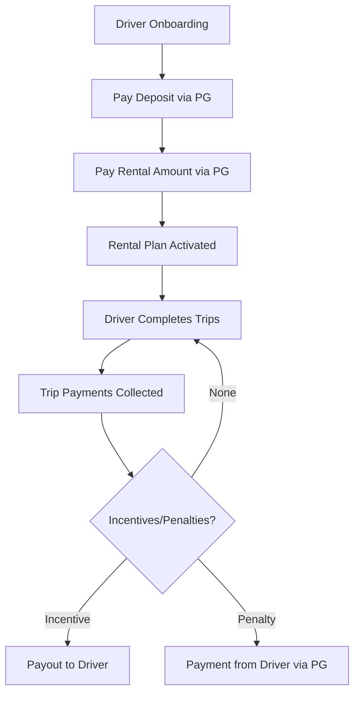

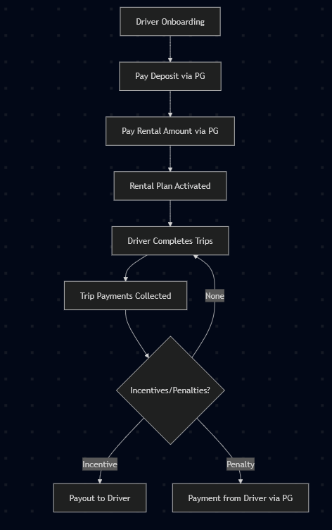

#### Components

| Component | Description | Payment Direction | Integration |
|-----------|-------------|-------------------|-------------|
| **Deposit** | Security deposit (refundable) | Driver → Platform | Easebuzz PG (CR) |
| **Rental** | Fixed rental amount for plan period | Driver → Platform | Easebuzz PG (CR) |
| **Trip Payments** | Per-trip earnings based on pricing | Customer → Platform | Easebuzz PG (CR) |
| **Incentives** | Performance bonuses | Platform → Driver | Easebuzz Payout (DR) |
| **Penalties** | Violations/damages | Driver → Platform | Easebuzz PG (CR) |

#### Configuration

- **Deposit Amount**: Configurable at fleet/driver level
- **Rental Amount**: Configurable at fleet/driver level
- **Rental Validity**: SIM-plan style (e.g., 7 days, 30 days, 90 days)
- **Trip Pricing**: Based on trip type (AIRPORT, RENTAL, INTER_CITY)

---

### 2.2 Payout Model (Revenue Share - Fleet Drivers Only)

The Payout Model is designed for drivers who share daily revenue with the platform.

#### Payment Flow

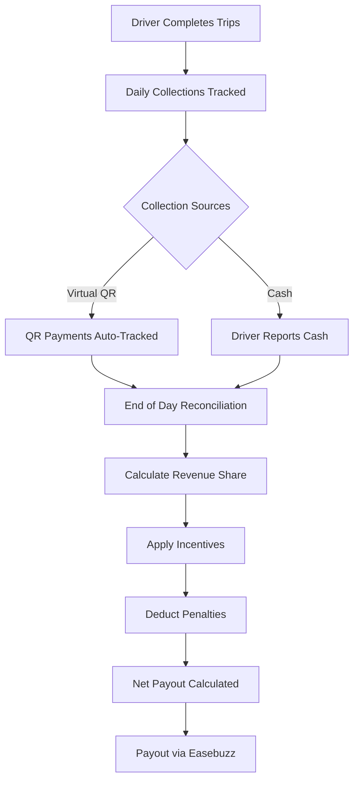

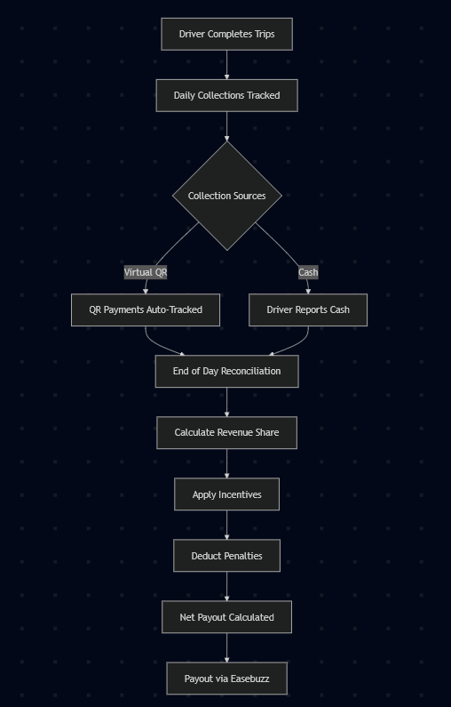

#### Components

| Component | Description | Payment Direction | Integration |
|-----------|-------------|-------------------|-------------|
| **Daily Collection** | Total revenue collected (QR + Cash) | Customer → Platform | Easebuzz Virtual QR (CR) |
| **Revenue Share** | Driver's percentage of daily collection | Platform → Driver | Easebuzz Payout (DR) |
| **Incentives** | Performance bonuses | Platform → Driver | Easebuzz Payout (DR) |
| **Penalties** | Violations/damages | Deducted from payout | Calculation only |

#### Configuration

- **Revenue Share %**: Default 70% to driver, 30% to platform (configurable)
- **Payout Frequency**: Daily/Weekly/On-demand
- **Minimum Payout**: Threshold amount for automated payout

#### Calculation Formula

```
Net Payout = (Daily Collection × Revenue Share %) + Incentives - Penalties
```

**Example:**

- Daily Collection: ₹5,000
- Revenue Share: 70%
- Incentives: ₹500 (5-star rating bonus)
- Penalties: ₹200 (late arrival)

```
Net Payout = (₹5,000 × 0.70) + ₹500 - ₹200
           = ₹3,500 + ₹500 - ₹200
           = ₹3,800
```

---

## 3. Collections System

### 3.1 Virtual QR Code Architecture

Each vehicle is assigned a unique virtual QR code for contactless payment collection.

#### QR Code Generation

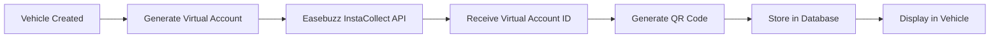


#### QR Code Properties

- **Unique per Vehicle**: One QR per vehicle
- **Dynamic Amount**: Customers can pay any amount
- **Auto-Reconciliation**: Payments auto-linked to vehicle
- **Real-time Tracking**: Instant webhook notifications

### 3.2 Driver-Vehicle Mapping

Collections are tracked based on active driver-vehicle assignments.

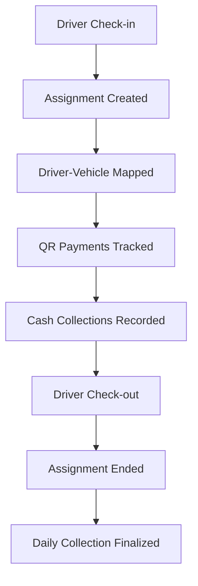


**Rules:**

- QR payments during assignment period → Attributed to driver
- Multiple drivers per day → Collections split by time periods
- No active assignment → Payments held for reconciliation

### 3.3 End-of-Day Reconciliation

Daily settlement process to verify and approve collections.

#### Reconciliation Workflow

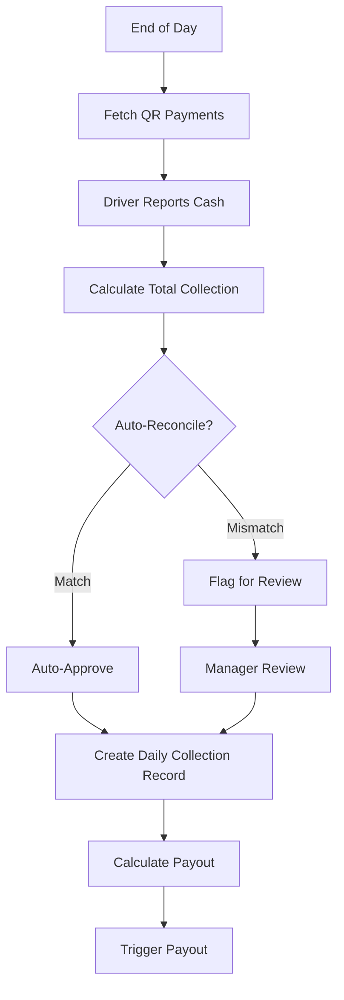


#### Reconciliation Data

| Field | Source | Description |
|-------|--------|-------------|
| QR Collection | Easebuzz Webhook | Auto-tracked payments via virtual QR |
| Cash Collection | Driver Input | Cash collected by driver |
| Total Collection | Calculated | QR + Cash |
| Expected Revenue | System | Based on completed trips |
| Variance | Calculated | Total - Expected |

---

## 4. Database Schema

### 4.1 Enums

```prisma
enum PaymentModel {
  RENTAL    // Fixed rental + deposit model
  PAYOUT    // Revenue share model
}

enum TransactionType {
  DEPOSIT           // Security deposit payment
  RENTAL            // Rental plan payment
  TRIP_PAYMENT      // Trip earnings
  INCENTIVE         // Performance bonus
  PENALTY           // Violation charge
  DAILY_COLLECTION  // Daily revenue collection
  PAYOUT            // Driver payout
}

enum TransactionStatus {
  PENDING    // Transaction initiated
  SUCCESS    // Payment successful
  FAILED     // Payment failed
  REFUNDED   // Payment refunded
}

enum PenaltyType {
  MONETARY      // Financial penalty - deducted from deposit or paid via PG
  WARNING       // Verbal/written warning - no financial impact
  SUSPENSION    // Temporary suspension from platform
  BLACKLIST     // Permanent ban from platform
}

enum PaymentMethod {
  PG_CARD         // Credit/Debit card via PG
  PG_UPI          // UPI via PG
  PG_NETBANKING   // Net banking via PG
  VIRTUAL_QR      // Virtual QR payment
  CASH            // Cash payment
}
```

### 4.2 Core Models

#### RentalPlan

Defines rental plan templates for fleet operators.

```prisma
model RentalPlan {
  id                 String         @id @default(uuid()) @db.Uuid
  fleetId            String         @db.Uuid
  fleet              Fleet          @relation(fields: [fleetId], references: [id])
  
  name               String         // e.g., "Weekly Plan", "Monthly Plan"
  rentalAmount       Float          // Rental fee
  depositAmount      Float          // Security deposit
  validityDays       Int            // Plan duration in days
  
  isActive           Boolean        @default(true)
  createdAt          DateTime       @default(now())
  updatedAt          DateTime       @updatedAt
  
  driverRentals      DriverRental[]
  
  @@index([fleetId])
  @@index([isActive])
}
```

#### DriverRental

Tracks active rental subscriptions for drivers.

```prisma
model DriverRental {
  id                 String         @id @default(uuid()) @db.Uuid
  driverId           String         @db.Uuid
  driver             Driver         @relation(fields: [driverId], references: [id])
  rentalPlanId       String         @db.Uuid
  rentalPlan         RentalPlan     @relation(fields: [rentalPlanId], references: [id])
  
  startDate          DateTime       // Plan start date
  expiryDate         DateTime       // Plan expiry date
  isActive           Boolean        @default(true)
  
  createdAt          DateTime       @default(now())
  updatedAt          DateTime       @updatedAt
  
  @@index([driverId])
  @@index([expiryDate])
  @@index([isActive])
}
```

#### Transaction

Universal transaction ledger for all financial activities.

```prisma
model Transaction {
  id                 String            @id @default(uuid()) @db.Uuid
  driverId           String            @db.Uuid
  driver             Driver            @relation(fields: [driverId], references: [id])
  
  type               TransactionType
  amount             Float
  status             TransactionStatus @default(PENDING)
  paymentMethod      PaymentMethod
  
  // Easebuzz integration fields
  easebuzzTxnId      String?           @unique
  easebuzzStatus     String?
  easebuzzPaymentId  String?
  
  // Reference IDs
  tripId             String?           @db.Uuid
  incentiveId        String?           @db.Uuid
  penaltyId          String?           @db.Uuid
  collectionId       String?           @db.Uuid
  
  description        String?
  metadata           Json?             // Additional data (PG response, etc.)
  
  createdAt          DateTime          @default(now())
  updatedAt          DateTime          @updatedAt
  
  @@index([driverId])
  @@index([type])
  @@index([status])
  @@index([createdAt])
  @@index([easebuzzTxnId])
}
```

#### Incentive

Driver performance incentives.

```prisma
model Incentive {
  id                 String         @id @default(uuid()) @db.Uuid
  driverId           String         @db.Uuid
  driver             Driver         @relation(fields: [driverId], references: [id])
  
  amount             Float
  reason             String         // e.g., "5-star rating bonus", "100 trips milestone"
  category           String?        // e.g., "PERFORMANCE", "MILESTONE", "REFERRAL"
  
  isPaid             Boolean        @default(false)
  paidAt             DateTime?
  transactionId      String?        @db.Uuid
  
  createdBy          String?        // Admin user ID
  createdAt          DateTime       @default(now())
  updatedAt          DateTime       @updatedAt
  
  @@index([driverId])
  @@index([isPaid])
  @@index([createdAt])
}
```

#### Penalty

Driver violations and penalties with multiple types and waiver support.

```prisma
model Penalty {
  id                    String       @id @default(uuid()) @db.Uuid
  driverId              String       @db.Uuid
  driver                Driver       @relation(fields: [driverId], references: [id])
  
  // Penalty details
  type                  PenaltyType  // MONETARY, WARNING, SUSPENSION, BLACKLIST
  amount                Float        @default(0)  // 0 for non-monetary penalties
  reason                String       // e.g., "Late arrival", "Customer complaint"
  category              String?      // e.g., "BEHAVIOR", "VEHICLE_DAMAGE", "POLICY_VIOLATION"
  
  // Payment tracking (for MONETARY penalties)
  isPaid                Boolean      @default(false)
  paidAt                DateTime?
  transactionId         String?      @db.Uuid
  
  // Deposit deduction (for RENTAL model drivers)
  deductedFromDeposit   Boolean      @default(false)
  depositDeductionAt    DateTime?
  depositDeductionAmount Float?
  
  // Suspension/Blacklist tracking (for non-monetary penalties)
  suspensionStartDate   DateTime?
  suspensionEndDate     DateTime?
  isActive              Boolean      @default(true)  // For blacklist/suspension status
  
  // Admin review and waiver tracking
  isWaived              Boolean      @default(false)
  waivedBy              String?      // Admin user ID who waived
  waivedAt              DateTime?
  waiverReason          String?      // Reason for waiving penalty
  reviewedBy            String?      // Admin user ID who reviewed
  reviewedAt            DateTime?
  reviewNotes           String?      @db.Text
  
  createdBy             String?      // Admin user ID
  createdAt             DateTime     @default(now())
  updatedAt             DateTime     @updatedAt
  
  @@index([driverId])
  @@index([type])
  @@index([isPaid])
  @@index([isActive])
  @@index([isWaived])
  @@index([createdAt])
}
```

**Penalty Types:**

| Type | Description | Financial Impact |
|------|-------------|------------------|
| `MONETARY` | Financial penalty | Amount charged to driver |
| `WARNING` | Verbal/written warning | No financial impact |
| `SUSPENSION` | Temporary platform ban | No direct financial impact |
| `BLACKLIST` | Permanent platform ban | No direct financial impact |

**Deposit Deduction (Rental Model):**

- Monetary penalties automatically deducted from deposit balance
- If insufficient deposit, partial deduction + payment gateway request
- Full audit trail of deductions maintained

**Waiver System:**

- Admins can review and waive any penalty
- Required waiver reason for audit trail
- Automatic refunds for waived monetary penalties
- Suspension cancellation for waived suspensions

See [PENALTY_SYSTEM.md](./PENALTY_SYSTEM.md) and [PENALTY_WAIVER_SYSTEM.md](./PENALTY_WAIVER_SYSTEM.md) for complete details.

#### VirtualQR

Vehicle-specific virtual QR codes for collections.

```prisma
model VirtualQR {
  id                 String         @id @default(uuid()) @db.Uuid
  vehicleId          String         @unique @db.Uuid
  vehicle            Vehicle        @relation(fields: [vehicleId], references: [id])
  
  // Easebuzz Virtual Account details
  virtualAccountId   String         @unique
  virtualAccountNumber String?      // Virtual account number
  ifscCode           String?        // IFSC code
  qrCodeUrl          String?        // QR code image URL
  qrCodeBase64       String?        @db.Text // QR code base64 data
  upiId              String?        @unique
  
  isActive           Boolean        @default(true)
  createdAt          DateTime       @default(now())
  updatedAt          DateTime       @updatedAt
  
  collections        DailyCollection[]
  
  @@index([vehicleId])
  @@index([virtualAccountId])
}
```

#### DailyCollection

Daily collection tracking and reconciliation.

```prisma
model DailyCollection {
  id                 String         @id @default(uuid()) @db.Uuid
  driverId           String         @db.Uuid
  driver             Driver         @relation(fields: [driverId], references: [id])
  vehicleId          String         @db.Uuid
  vehicle            Vehicle        @relation(fields: [vehicleId], references: [id])
  virtualQRId        String?        @db.Uuid
  virtualQR          VirtualQR?     @relation(fields: [virtualQRId], references: [id])
  
  date               DateTime       @db.Date
  
  // Collection breakdown
  qrCollectionAmount Float          @default(0)  // Paid via virtual QR
  cashCollectionAmount Float        @default(0)  // Cash collected by driver
  totalCollection    Float          // qrCollection + cashCollection
  
  // Expected vs Actual
  expectedRevenue    Float?         // Based on completed trips
  variance           Float?         // totalCollection - expectedRevenue
  
  // Payout calculation (for PAYOUT model)
  revSharePercentage Float?         // e.g., 70
  revShareAmount     Float?         // totalCollection × revSharePercentage
  incentiveAmount    Float          @default(0)
  penaltyAmount      Float          @default(0)
  netPayout          Float?         // revShare + incentive - penalty
  
  // Reconciliation
  isReconciled       Boolean        @default(false)
  reconciledBy       String?        // Admin/Manager user ID
  reconciledAt       DateTime?
  reconciliationNotes String?       @db.Text
  
  // Payout
  isPaid             Boolean        @default(false)
  paidAt             DateTime?
  payoutTransactionId String?       @db.Uuid
  
  createdAt          DateTime       @default(now())
  updatedAt          DateTime       @updatedAt
  
  @@unique([driverId, date])
  @@index([driverId])
  @@index([vehicleId])
  @@index([date])
  @@index([isReconciled])
  @@index([isPaid])
}
```

### 4.3 Driver Model Extensions

```prisma
model Driver {
  // ... existing fields
  
  // Payment model configuration
  paymentModel       PaymentModel?  // RENTAL or PAYOUT
  depositBalance     Float          @default(0)
  
  // Revenue share configuration (for PAYOUT model)
  revSharePercentage Float?         @default(70)
  
  // Bank account for payouts
  bankAccountNumber  String?
  bankIfscCode       String?
  bankAccountName    String?
  
  // Relations
  driverRentals      DriverRental[]
  transactions       Transaction[]
  incentives         Incentive[]
  penalties          Penalty[]
  dailyCollections   DailyCollection[]
}
```

### 4.4 Vehicle Model Extensions

```prisma
model Vehicle {
  // ... existing fields
  
  // Virtual QR for collections
  virtualQRId        String?        @unique @db.Uuid
  virtualQR          VirtualQR?
  
  // Relations
  dailyCollections   DailyCollection[]
}
```

---

## 5. Easebuzz Integration

### 5.1 Payment Gateway (Payment In)

**Use Cases:**

- Deposit payments
- Rental payments
- Penalty payments

#### API Endpoint

```
POST https://pay.easebuzz.in/payment/initiateLink
```

#### Request Format

```typescript
interface InitiatePaymentRequest {
  key: string;              // Merchant key
  txnid: string;            // Unique transaction ID
  amount: string;           // Amount in INR
  productinfo: string;      // Product description
  firstname: string;        // Customer name
  phone: string;            // Customer phone
  email: string;            // Customer email
  surl: string;             // Success URL
  furl: string;             // Failure URL
  hash: string;             // SHA-512 hash
  udf1?: string;            // Custom field 1 (driverId)
  udf2?: string;            // Custom field 2 (transactionType)
}
```

#### Hash Calculation

```typescript
const hashString = `${key}|${txnid}|${amount}|${productinfo}|${firstname}|${email}|${udf1}|${udf2}|||||||||${salt}`;
const hash = crypto.createHash('sha512').update(hashString).digest('hex');
```

#### Response Format

```typescript
interface PaymentResponse {
  status: number;           // 1 = success, 0 = failure
  data: string;             // Payment URL
}
```

### 5.2 Payouts (Payment Out)

**Use Cases:**

- Incentive payouts
- Daily revenue share payouts

#### API Endpoint

```
POST https://api.easebuzz.in/payout/v1/create
```

#### Request Format

```typescript
interface CreatePayoutRequest {
  merchant_key: string;
  merchant_txn_id: string;  // Unique transaction ID
  beneficiary_name: string;
  beneficiary_account: string;
  beneficiary_ifsc: string;
  amount: string;           // Amount in INR
  purpose: string;          // Payout purpose
  transfer_mode: 'NEFT' | 'RTGS' | 'IMPS';
  hash: string;             // SHA-256 hash
}
```

#### Hash Calculation

```typescript
const hashString = `${merchant_key}|${merchant_txn_id}|${amount}|${salt}`;
const hash = crypto.createHash('sha256').update(hashString).digest('hex');
```

#### Response Format

```typescript
interface PayoutResponse {
  status: number;           // 1 = success, 0 = failure
  msg: string;
  data: {
    txn_id: string;         // Easebuzz transaction ID
    status: string;         // PENDING, SUCCESS, FAILED
    utr: string;            // UTR number (if successful)
  };
}
```

### 5.3 Virtual Accounts (InstaCollect)

**Use Cases:**

- Generate vehicle-specific QR codes
- Track QR payments via webhooks

#### Create Virtual Account

```
POST https://api.easebuzz.in/instacollect/v1/create
```

#### Request Format

```typescript
interface CreateVirtualAccountRequest {
  merchant_key: string;
  virtual_account_name: string;  // Vehicle number
  customer_name: string;         // Fleet name
  customer_mobile: string;
  customer_email: string;
  udf1?: string;                 // vehicleId
  hash: string;
}
```

#### Response Format

```typescript
interface VirtualAccountResponse {
  status: number;
  msg: string;
  data: {
    virtual_account_id: string;
    virtual_account_number: string;
    ifsc_code: string;
    qr_code: string;              // Base64 QR code
    upi_id: string;
  };
}
```

#### Webhook Notification

When a payment is received on the virtual account:

```typescript
interface VirtualAccountWebhook {
  merchant_key: string;
  virtual_account_id: string;
  txn_id: string;
  amount: string;
  payment_mode: string;
  utr: string;
  txn_date: string;
  udf1: string;                   // vehicleId
  hash: string;
}
```

---

## 6. API Endpoints

### 6.1 Driver APIs

#### Get Balance & Rental Status

```http
GET /api/payment/balance
Authorization: Bearer <driver_jwt>
```

**Response:**

```json
{
  "depositBalance": 15000,
  "rentalPlan": {
    "name": "Monthly Plan",
    "expiryDate": "2025-01-28T00:00:00Z",
    "daysRemaining": 23,
    "isActive": true
  },
  "paymentModel": "RENTAL"
}
```

#### Get Transactions

```http
GET /api/payment/transactions?page=1&limit=20&type=INCENTIVE
Authorization: Bearer <driver_jwt>
```

**Query Parameters:**

- `page`: Page number (default: 1)
- `limit`: Items per page (default: 20)
- `type`: Filter by transaction type (optional)
- `status`: Filter by status (optional)
- `startDate`: Filter from date (optional)
- `endDate`: Filter to date (optional)

**Response:**

```json
{
  "transactions": [
    {
      "id": "uuid",
      "type": "TRIP_PAYMENT",
      "amount": 450,
      "status": "SUCCESS",
      "paymentMethod": "VIRTUAL_QR",
      "description": "Trip #1234 payment",
      "createdAt": "2025-12-29T14:30:00Z"
    }
  ],
  "pagination": {
    "page": 1,
    "limit": 20,
    "total": 150,
    "totalPages": 8
  }
}
```

#### Get Transaction Details

```http
GET /api/payment/transactions/:id
Authorization: Bearer <driver_jwt>
```

**Response:**

```json
{
  "id": "uuid",
  "type": "INCENTIVE",
  "amount": 500,
  "status": "SUCCESS",
  "paymentMethod": "PG_UPI",
  "description": "5-star rating bonus",
  "easebuzzTxnId": "EBZ123456",
  "metadata": {
    "category": "PERFORMANCE",
    "tripCount": 50,
    "rating": 5.0
  },
  "createdAt": "2025-12-29T14:30:00Z",
  "updatedAt": "2025-12-29T14:31:00Z"
}
```

#### Get Incentives

```http
GET /api/payment/incentives?isPaid=false
Authorization: Bearer <driver_jwt>
```

**Response:**

```json
{
  "incentives": [
    {
      "id": "uuid",
      "amount": 500,
      "reason": "5-star rating bonus",
      "category": "PERFORMANCE",
      "isPaid": false,
      "createdAt": "2025-12-29T10:00:00Z"
    }
  ],
  "totalUnpaid": 1500,
  "totalPaid": 3000
}
```

#### Get Penalties

```http
GET /api/payment/penalties?isPaid=false
Authorization: Bearer <driver_jwt>
```

**Response:**

```json
{
  "penalties": [
    {
      "id": "uuid",
      "amount": 200,
      "reason": "Late arrival - Trip #1234",
      "category": "BEHAVIOR",
      "isPaid": false,
      "createdAt": "2025-12-28T16:00:00Z"
    }
  ],
  "totalUnpaid": 400,
  "totalPaid": 800
}
```

#### Initiate Deposit Payment

```http
POST /api/payment/deposit
Authorization: Bearer <driver_jwt>
Content-Type: application/json

{
  "amount": 15000
}
```

**Response:**

```json
{
  "paymentUrl": "https://pay.easebuzz.in/pay/...",
  "transactionId": "uuid",
  "expiresAt": "2025-12-29T15:00:00Z"
}
```

#### Initiate Rental Payment

```http
POST /api/payment/rental
Authorization: Bearer <driver_jwt>
Content-Type: application/json

{
  "rentalPlanId": "uuid"
}
```

**Response:**

```json
{
  "paymentUrl": "https://pay.easebuzz.in/pay/...",
  "transactionId": "uuid",
  "rentalPlan": {
    "name": "Monthly Plan",
    "amount": 8000,
    "validityDays": 30
  }
}
```

---

### 6.2 Admin APIs

#### Configure Driver Payment Model

```http
POST /api/admin/payment/configure
Authorization: Bearer <admin_jwt>
Content-Type: application/json

{
  "driverId": "uuid",
  "paymentModel": "RENTAL",
  "revSharePercentage": 70
}
```

#### Create Rental Plan

```http
POST /api/admin/payment/rental-plan
Authorization: Bearer <admin_jwt>
Content-Type: application/json

{
  "fleetId": "uuid",
  "name": "Weekly Plan",
  "rentalAmount": 2000,
  "depositAmount": 10000,
  "validityDays": 7
}
```

#### Add Incentive

```http
POST /api/admin/payment/incentive
Authorization: Bearer <admin_jwt>
Content-Type: application/json

{
  "driverId": "uuid",
  "amount": 500,
  "reason": "100 trips milestone",
  "category": "MILESTONE"
}
```

#### Add Penalty

```http
POST /api/admin/payment/penalty
Authorization: Bearer <admin_jwt>
Content-Type: application/json

{
  "driverId": "uuid",
  "amount": 200,
  "reason": "Customer complaint - Trip #1234",
  "category": "BEHAVIOR"
}
```

#### Get Daily Collections

```http
GET /api/admin/payment/collections?date=2025-12-29&isReconciled=false
Authorization: Bearer <admin_jwt>
```

**Response:**

```json
{
  "collections": [
    {
      "id": "uuid",
      "driver": {
        "id": "uuid",
        "name": "John Doe"
      },
      "vehicle": {
        "id": "uuid",
        "vehicleNumber": "DL01AB1234"
      },
      "date": "2025-12-29",
      "qrCollectionAmount": 3500,
      "cashCollectionAmount": 1500,
      "totalCollection": 5000,
      "expectedRevenue": 4800,
      "variance": 200,
      "netPayout": 3800,
      "isReconciled": false
    }
  ]
}
```

#### Reconcile Daily Collection

```http
POST /api/admin/payment/reconcile/:collectionId
Authorization: Bearer <admin_jwt>
Content-Type: application/json

{
  "isApproved": true,
  "notes": "Variance explained - extra tip from customer"
}
```

#### Trigger Manual Payout

```http
POST /api/admin/payment/payout
Authorization: Bearer <admin_jwt>
Content-Type: application/json

{
  "driverId": "uuid",
  "amount": 3800,
  "purpose": "Daily payout - 2025-12-29"
}
```

---

### 6.3 Webhook Endpoints

#### Easebuzz Payment Webhook

```http
POST /api/webhooks/easebuzz/payment
Content-Type: application/json

{
  "txnid": "TXN123456",
  "status": "success",
  "amount": "15000.00",
  "firstname": "John Doe",
  "email": "john@example.com",
  "phone": "9876543210",
  "productinfo": "Deposit Payment",
  "hash": "...",
  "udf1": "driverId",
  "udf2": "DEPOSIT"
}
```

#### Easebuzz Virtual Account Webhook

```http
POST /api/webhooks/easebuzz/virtual-account
Content-Type: application/json

{
  "virtual_account_id": "VA123456",
  "txn_id": "TXN789012",
  "amount": "450.00",
  "payment_mode": "UPI",
  "utr": "UTR123456",
  "txn_date": "2025-12-29 14:30:00",
  "udf1": "vehicleId",
  "hash": "..."
}
```

---

## 7. Business Logic Flows

### 7.1 Rental Model - Driver Onboarding

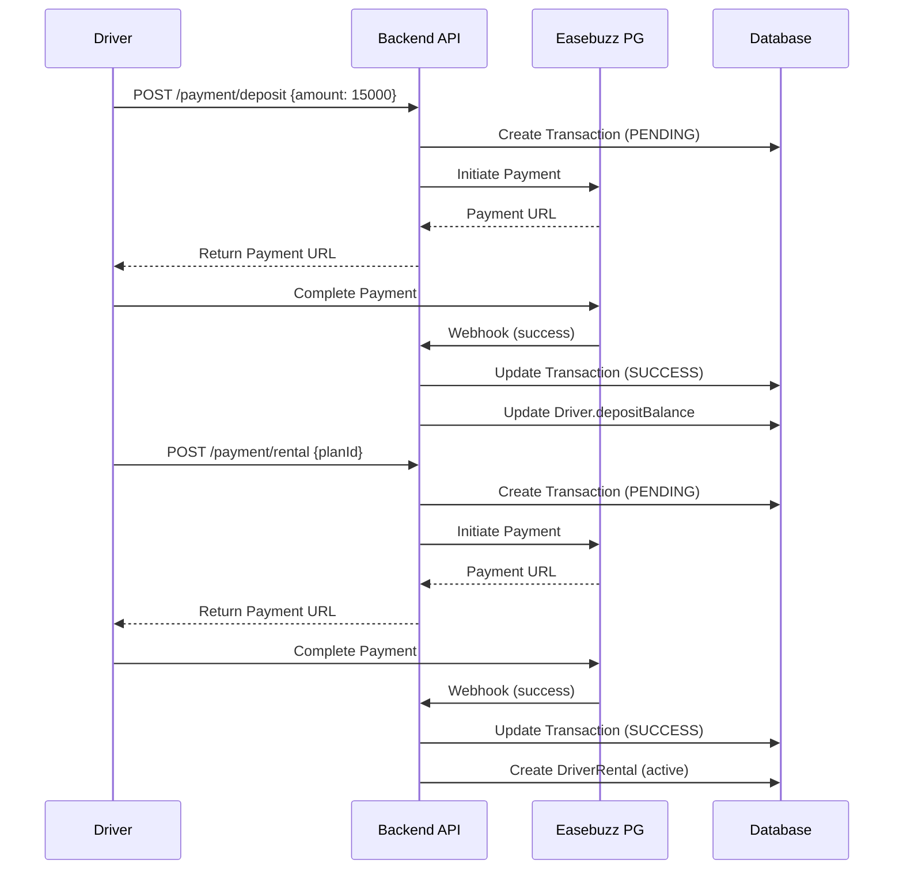


### 7.2 Payout Model - Daily Settlement

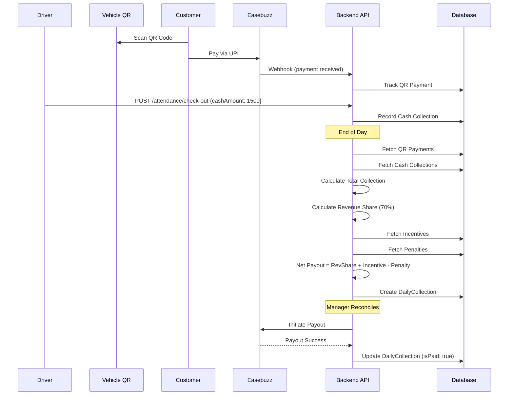

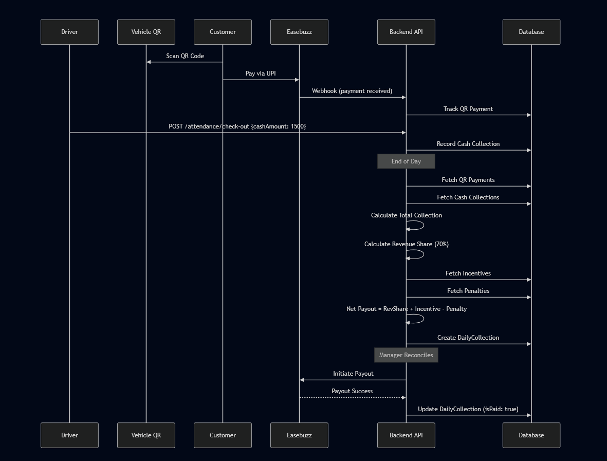

### 7.3 Virtual QR Payment Flow

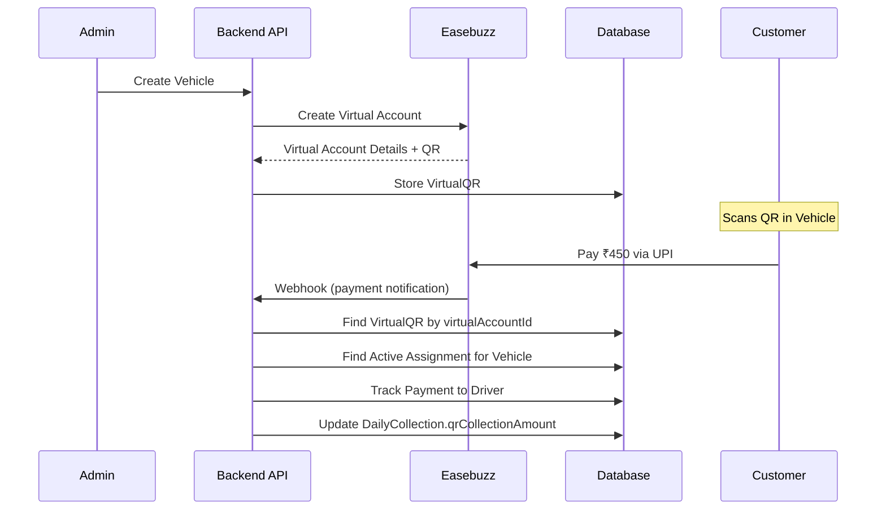


---

## 8. UI/UX Specifications

### 8.1 Driver Mobile App

#### Balance & Rental Status Screen

**Top Card:**

- Large balance display: "₹15,000"
- Label: "Deposit Balance"
- SIM-plan style validity: "Rental Valid: 23 days remaining"
- Progress bar showing validity percentage

**Tabs:**

- All Transactions (default)
- Incentives
- Penalties

**Transaction List:**
Each entry shows:

- Icon (colored by type)
- Transaction type
- Amount (green for credit, red for debit)
- Timestamp
- Brief description

**Actions:**

- Tap entry → View detailed transaction
- Pull to refresh
- Infinite scroll pagination

#### Transaction Detail Screen

- Transaction type badge
- Amount (large, colored)
- Status badge
- Payment method
- Description
- Easebuzz transaction ID
- Metadata (if applicable)
- Timestamp
- Download receipt button

### 8.2 Admin Dashboard

#### Collections Dashboard

**Filters:**

- Date range picker
- Driver filter
- Vehicle filter
- Reconciliation status

**Collection Cards:**
Each card shows:

- Driver name & photo
- Vehicle number
- QR Collection: ₹3,500
- Cash Collection: ₹1,500
- Total: ₹5,000
- Expected: ₹4,800
- Variance: +₹200 (highlighted if > threshold)
- Net Payout: ₹3,800
- Reconcile button

**Actions:**

- View details
- Approve/Reject reconciliation
- Trigger payout
- Export report

---

## 9. Security & Compliance

### 9.1 Payment Security

- **Hash Verification**: All Easebuzz requests verified with SHA-512/SHA-256 hash
- **Webhook Validation**: IP whitelist + hash verification
- **SSL/TLS**: All payment communications over HTTPS
- **PCI-DSS**: No card data stored in database
- **Tokenization**: Use Easebuzz tokens for recurring payments

### 9.2 Data Protection

- **Encryption**: Sensitive data encrypted at rest
- **Access Control**: Role-based access to financial data
- **Audit Logs**: All financial transactions logged
- **Data Retention**: Transaction data retained per regulatory requirements

### 9.3 Fraud Prevention

- **Duplicate Detection**: Prevent duplicate transactions
- **Amount Limits**: Min/max transaction limits
- **Velocity Checks**: Rate limiting on payment requests
- **Reconciliation**: Daily automated reconciliation
- **Alerts**: Anomaly detection for unusual patterns

---

## 10. Implementation Roadmap

### Phase 1: Foundation (Week 1)

- [ ] Database schema design
- [ ] Prisma migration
- [ ] Easebuzz adapter setup
- [ ] Environment configuration

### Phase 2: Rental Model (Week 2)

- [ ] Rental service implementation
- [ ] Payment gateway integration
- [ ] Deposit & rental payment flows
- [ ] Rental plan management

### Phase 3: Payout Model (Week 3)

- [ ] Payout service implementation
- [ ] Revenue share calculation
- [ ] Daily collection tracking
- [ ] Reconciliation logic

### Phase 4: Virtual QR (Week 4)

- [ ] Virtual account creation
- [ ] QR code generation
- [ ] Webhook handler
- [ ] Collection automation

### Phase 5: APIs (Week 5)

- [ ] Driver APIs
- [ ] Admin APIs
- [ ] Webhook endpoints
- [ ] API documentation

### Phase 6: Testing & Launch (Week 6)

- [ ] Unit tests
- [ ] Integration tests
- [ ] End-to-end testing
- [ ] Production deployment

---

## Appendix

### A. Easebuzz API References

- **Payment Gateway**: <https://docs.easebuzz.in/docs/payment-gateway/rt8pognkld0wb-payment-methods>
- **Payouts**: <https://docs.easebuzz.in/docs/neobanking/zacms0lnxnniz-payouts>
- **Virtual Accounts**: <https://docs.easebuzz.in/docs/neobanking/ykrkzriis6ez5-insta-collect-virtual-accounts>

### B. Configuration Reference

```env
# Easebuzz Configuration
EASEBUZZ_MERCHANT_KEY=your-merchant-key
EASEBUZZ_SALT_KEY=your-salt-key
EASEBUZZ_ENV=test  # test | production
EASEBUZZ_BASE_URL=https://testpay.easebuzz.in

# Payment Configuration
DEFAULT_REV_SHARE_PERCENTAGE=70
MIN_PAYOUT_AMOUNT=100
MAX_TRANSACTION_AMOUNT=100000
PAYOUT_FREQUENCY=DAILY  # DAILY | WEEKLY | ON_DEMAND

# Webhook URLs
PAYMENT_SUCCESS_URL=https://api.driversklub.com/webhooks/easebuzz/success
PAYMENT_FAILURE_URL=https://api.driversklub.com/webhooks/easebuzz/failure
```

---

**End of Documentation**
