# 💰 Payment System Documentation (Production)

**Version:** 3.1.0
**Date:** January 9, 2026
**Status:** Live / Production

---

## Table of Contents

1. [High-Level Ecosystem Overview](#1-high-level-ecosystem-overview)
2. [Detailed Workflows](#2-detailed-workflows)
3. [Overview](#3-overview)
4. [Driver Models](#4-driver-models)
5. [Database Schema Overview](#5-database-schema-overview)
6. [API Reference and Usage Guide](#6-api-reference-and-usage-guide)
7. [Integration Notes](#7-integration-notes)
8. [Testing & Test Credentials](#8-testing--test-credentials)

---

## 1. High-Level Ecosystem Overview

```mermaid
graph TD
    subgraph "External World"
        Passenger((Passenger))
        Bank((Bank/UPI))
    end

    subgraph "Drivers Klub Platform"
        API[API Gateway]
        subgraph "Modules"
            Rental[Rental Service]
            Payout[Payout Service]
            Collection[Collection System]
            Orders[InstaCollect Orders]
            Wallet[Driver Wallet]
        end
        DB[(Database)]
    end

    subgraph "Payment Gateway (Easebuzz)"
        PG[PG (Pay In)]
        IC[InstaCollect (QR)]
        PayoutAPI[Payout (Pay Out)]
    end

    %% Passenger Flow
    Passenger -->|Pay via QR| IC
    IC -->|Webhook| API
    API -->|Record| Collection

    %% Driver Flow (Rental)
    Driver((Rental Driver)) -->|Pay Security Deposit| API
    Driver -->|Pay Rental Fee| API
    API -->|Init Payment| PG
    PG -->|Webhook Success| API
    API -->|Update| Wallet
    API -->|Activate| Rental

    %% Driver Flow (Payout)
    PayoutAPI -->|Transfer Funds| Driver2((Payout Driver))
    
    %% Admin Flow
    Admin((Admin)) -->|Reconcile| API
    API -->|Update| Collection
    Admin -->|Trigger Payout| API
    API -->|Request Transfer| PayoutAPI
    
    %% Database Sync
    Rental --> DB
    Payout --> DB
    Collection --> DB
    Wallet --> DB
```

## 2. Detailed Workflows

### A. Rental Model Flow (Driver Pays Platform)

This flow handles how drivers pay for vehicle rentals and security deposits.

```mermaid
sequenceDiagram
    participant Driver
    participant App
    participant API
    participant DB as Database
    participant PG as Easebuzz PG

    %% Deposit
    Note over Driver, PG: Security Deposit Process
    Driver->>App: Initiate Deposit (₹10,000)
    App->>API: POST /payment/deposit
    API->>PG: Initiate Payment Amount
    PG-->>API: Payment Link
    API-->>App: Return Payment URL
    App->>Driver: Opens Webview/Browser
    Driver->>PG: Completes Payment (UPI/Card)
    PG->>API: Webhook (Status: SUCCESS)
    API->>DB: Update Transaction & Balance
    
    %% Rental Purchase
    Note over Driver, PG: Rental Plan Purchase
    Driver->>App: Buy Weekly Plan (₹3,000)
    App->>API: POST /payment/rental
    API->>DB: Check Deposit Balance
    alt Sufficient Balance
        API->>DB: Deduct from Deposit (Optional Config)
        API->>DB: Create DriverRental Record
        API-->>App: Success
    else Insufficient Balance
        API->>PG: Initiate Difference Payment
        PG-->>API: Payment Link
        Driver->>PG: Pay Difference
        PG->>API: Webhook Success
        API->>DB: Activate Rental Plan
    end
```



### B. Payout Model Flow (Platform Pays Driver)

This flow explains how daily collections are turned into driver earnings.


### C. Bulk Payout Process

Handling mass payments via CSV upload.


### D. InstaCollect Orders (Ad-Hoc)

Flow for generating dynamic QR codes for one-off or recurring ad-hoc payments.

```mermaid
sequenceDiagram
    participant Customer
    participant Admin
    participant API
    participant DB
    participant Easebuzz

    Admin->>API: Create Order (₹5000)
    API->>Easebuzz: Create Virtual Account (Type: ORDER)
    Easebuzz-->>API: VA Details + QR
    API->>DB: Save PaymentOrder (PENDING)
    API-->>Admin: Return QR Code

    Customer->>Easebuzz: Partial Pay ₹2000 via UPI
    Easebuzz->>API: Webhook (Credit)
    API->>DB: Record Transaction
    API->>DB: Update Order (collected: 2000, status: PARTIAL)

    Customer->>Easebuzz: Pay remaining ₹3000
    Easebuzz->>API: Webhook (Credit)
    API->>DB: Record Transaction
    API->>DB: Update Order (collected: 5000, status: COMPLETED)
```



## 3. Overview

The Drivers Klub Payment System allows for comprehensive financial management of the fleet. It supports two primary driver models: **Rental** and **Payout**. All external money movement is handled via the **Easebuzz** payment gateway.

### Core Features

- **Rental Management**: Automated collection of rental fees from drivers.
- **Payout Management**: Manual calculation and automated disbursement of driver earnings via Bulk Payouts.
- **Virtual QR Collection**: Unique QR codes for every vehicle to track passenger payments directly.
- **Security Deposits**: Management of driver security deposits.
- **Penalties & Incentives**: Flexible system to add bonuses or deduct fines.

---

## 4. Driver Models

*(See previous versions for theoretical details. This section emphasizes API Implementation)*

1. **Rental Model**: Driver pays fixed rent.
2. **Payout Model**: Driver payouts are managed manually via bulk CSV upload.

---

## 5. Database Schema Overview

- **Transaction**: Central ledger for all financial events.

- **DailyCollection**: Daily earnings per driver (Cash/QR).
- **DriverRental**: Active rental plan subscriptions.
- **VirtualQR**: Maps Vehicle -> Easebuzz Virtual Account.
- **PaymentOrder**: Ad-hoc orders for dynamic QR payments (supports partial payments).

---

## 6. API Reference and Usage Guide

All API requests typically require the `Authorization` header with a valid JWT.
`Authorization: Bearer <token>`

---

### A. Driver Endpoints

**Base URL**: `/api/payment`
**User Role**: `DRIVER`

#### 1. Get Balance & Rental Status

Retrieves the driver's current deposit balance and details of any active rental plan.

- **Endpoint**: `GET /balance`
- **Usage**: call this on the Wallet Screen to show current status.
- **Response**:

    ```json
    {
        "success": true,
        "data": {
            "depositBalance": 10000,
            "paymentModel": "RENTAL",
            "hasActiveRental": true,
            "rental": {
                "planName": "Weekly Gold",
                "startDate": "2025-01-01T00:00:00.000Z",
                "expiryDate": "2025-01-07T23:59:59.999Z",
                "daysRemaining": 2,
                "isExpired": false
            }
        },
        "message": "Balance retrieved successfully"
    }
    ```

#### 2. Get Transaction History

Retrieves a paginated list of financial transactions.

- **Endpoint**: `GET /transactions`
- **Query Params**:
  - `page`: number (default 1)
  - `limit`: number (default 20)
  - `type`: Filter by `DEPOSIT`, `RENTAL`, `PAYOUT`, etc.
  - `startDate`: ISO Date string
  - `endDate`: ISO Date string
- **Response**:

    ```json
    {
        "success": true,
        "data": {
            "transactions": [
                {
                    "id": "uuid...",
                    "type": "RENTAL",
                    "amount": 5000,
                    "status": "SUCCESS",
                    "createdAt": "2025-01-05..."
                }
            ],
            "pagination": { "page": 1, "limit": 20, "total": 50 }
        }
    }
    ```

#### 3. Initiate Security Deposit

Generates a payment link for the driver to add money to their deposit wallet.

- **Endpoint**: `POST /deposit`
- **Request Body**:

    ```json
    {
        "amount": 5000
    }
    ```

- **Response**:

    ```json
    {
        "success": true,
        "data": {
            "transactionId": "uuid...",
            "paymentUrl": "https://testpay.easebuzz.in/pay/...",
            "txnId": "EB-123456"
        },
        "message": "Deposit payment initiated"
    }
    ```

- **Usage**: Redirect the user to `paymentUrl`. Upon success at the gateway, the system updates the transaction to `SUCCESS` via webhook.

#### 4. Get Available Rental Plans

List all rental plans available for the driver's fleet.

- **Endpoint**: `GET /rental/plans`
- **Response**:

    ```json
    {
        "success": true,
        "data": [
            {
                "id": "uuid-plan-1",
                "name": "Weekly Starter",
                "rentalAmount": 3000,
                "depositAmount": 5000,
                "validityDays": 7,
                "isActive": true
            }
        ],
        "message": "Rental plans retrieved successfully"
    }
    ```

#### 5. Initiate Rental Payment

Allows a driver to purchase or renew a rental plan.

- **Endpoint**: `POST /rental`
- **Request Body**:

    ```json
    {
        "rentalPlanId": "uuid-of-plan"
    }
    ```

- **Response**: similar to Deposit, returns `paymentUrl`.

- **Note**: Requires sufficient `depositBalance` (if configured to check) or valid payment method.

#### 6. Get Daily Collections

For drivers on the **Payout Model**, this shows their daily earnings.

- **Endpoint**: `GET /collections`
- **Query Params**: `startDate`, `endDate`.
- **Response**:

    ```json
    {
        "success": true,
        "data": {
            "collections": [
                {
                    "date": "2025-01-04...",
                    "totalCollection": 4500,
                    "date": "2025-01-04...",
                    "totalCollection": 4500,
                    "netPayout": 0, // Calculated/Paid manually via Bulk CSV
                    "isPaid": false
                }
            ],
            ],
            "summary": { 
                "totalCollections": 4500, // Gross Earnings
                "totalPayout": 3000,      // Actually Paid
                "deductions": 1500,       // Commission/Platform Fee (Calculated Difference)
                "balance": 0              // No pending dues
            }
        }
    }
    ```

---

### B. Admin Endpoints

**Base URL**: `/api/payment/admin`
**User Roles**: `SUPER_ADMIN`, `OPERATIONS`

#### 1. Create Rental Plan

Defines a new plan that drivers can subscribe to.

- **Endpoint**: `POST /rental-plans`
- **Request Body**:

    ```json
    {
        "fleetId": "uuid-fleet",
        "name": "Weekly Starter",
        "rentalAmount": 3000,
        "depositAmount": 10000,
        "validityDays": 7
    }
    ```

#### 2. Create Penalty

Manually assign a penalty to a driver.

- **Endpoint**: `POST /penalty`
- **Request Body**:

    ```json
    {
        "driverId": "uuid-driver",
        "type": "MONETARY", // or WARNING, SUSPENSION
        "amount": 500,
        "reason": "Vehicle Damage",
        "category": "FLEET_RULE"
    }
    ```

#### 3. Create Incentive

Award a bonus to a driver.

- **Endpoint**: `POST /incentive`
- **Request Body**:

    ```json
    {
        "driverId": "uuid-driver",
        "amount": 200,
        "reason": "Perfect Week Bonus",
        "category": "PERFORMANCE"
    }
    ```

#### 4. Reconcile Daily Collection

Admins review daily collections and finalize them (Approving correctness of Cash vs QR).

- **Endpoint**: `POST /collection/:id/reconcile`
- **Request Body**:

    ```json
    {
        "expectedRevenue": 5000, // Optional override/check
        "reconciliationNotes": "Verified with driver logs"
    }
    ```

#### 5. Process Payout

Trigger manual payout for a reconciled collection (if not automated).

- **Endpoint**: `POST /collection/:id/payout`
- **Response**:

    ```json
    {
        "success": true,
        "txnId": "EB-PAYOUT-123",
        "status": "SUCCESS"
    }
    ```

#### 6. Bulk Payout Upload (New)

Upload a CSV to process multiple payouts/penalties at once.

- **Endpoint**: `POST /bulk-payout`
- **Header**: `Content-Type: multipart/form-data`
- **Body**: Form-data with key `file` containing the CSV.
- **CSV Format**:

    ```csv
    phone,accountNumber,amount,penalty,incentive,payoutCycle
    9876543210,,5000,0,200,Week 1 Jan
    ```

- **Response**: Summary of success/failed rows.

#### 7. Generate Virtual QR

Create a Virtual QR for a specific vehicle.

- **Endpoint**: `POST /vehicle/:id/qr`
- **Response**:

    ```json
    {
        "success": true,
        "data": {
            "virtualAccountNumber": "VA12345",
            "qrCodeBase64": "data:image/png;base64,..."
        }
    }
    ```

#### 8. InstaCollect Order (Create)

Create a dynamic QR order for ad-hoc payments.

- **Endpoint**: `POST /orders`
- **Request Body**:

    ```json
    {
        "customerName": "John Doe",
        "customerPhone": "9876543210",
        "description": "Advance Payment",
        "amount": 5000
    }
    ```

- **Response**: Returns `qrCodeBase64` and `virtualAccountNumber`.

#### 9. InstaCollect Order (Get)

Track status and partial payments.

- **Endpoint**: `GET /orders/:id`
- **Response**:

    ```json
    {
        "id": "uuid",
        "totalAmount": 5000,
        "collectedAmount": 2000,
        "remainingAmount": 3000,
        "status": "PARTIAL",
        "transactions": [ ... ]
    }
    ```

---

## 7. Integration Notes

- **Webhooks**: Ensure the public URL for the backend is configured in the Easebuzz dashboard.
- **Environment Variables**:
  - `EASEBUZZ_MERCHANT_KEY`
  - `EASEBUZZ_SALT_KEY`
  - `EASEBUZZ_ENV` (test/production)
- **Virtual Accounts (Test Mode)**:
  - In `test` environment, the system uses a **Mock Implementation** because the Easebuzz Wire API is IP-restricted.
  - The API will returning dummy Virtual Account credentials (`VA_...`, `TEST...`) for local testing.
  - In `production`, it connects to `https://wire.easebuzz.in`.

---

## 8. Testing & Test Credentials

Use the following test cards for simulating payment flows in the `test` environment.

| Card Type | Card Number | Expiry | CVV |
| :--- | :--- | :--- | :--- |
| **MasterCard** | `5553 0422 4198 4105` | `07/2028` | `123` |
| **Visa** | `4012 8888 8888 1881` | `07/2028` | `123` |
